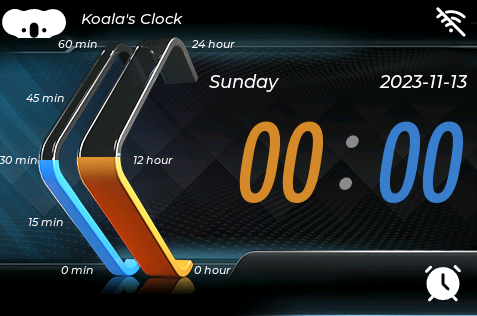

# A Clock based on ESP32S3

Here is a clock UI, based on WT-SC01-PLUS, which has ESP32S3 chip.

  

It involves:

* Arduino Framework
* VS code with PlatformIO

## Hardware

WT-SC01-PLUS (aka.ZX3D50CE02S-USRC-4832 in China)

## UI

I have modified the Squareline example *Futuristic_Ebike*, the ordinary like this:

  

I re-use the background and sliders pictures, fonts and etc., because it's hard to me.

The new one like this:

  

BTW, Squareline is amazing, that can make UI so easily.

## Software

TODO

## How to use

TODO
