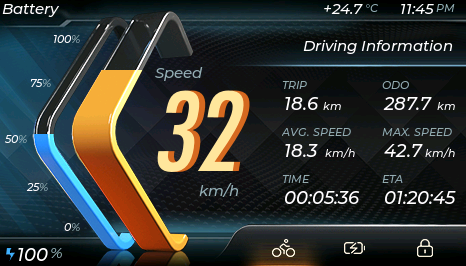
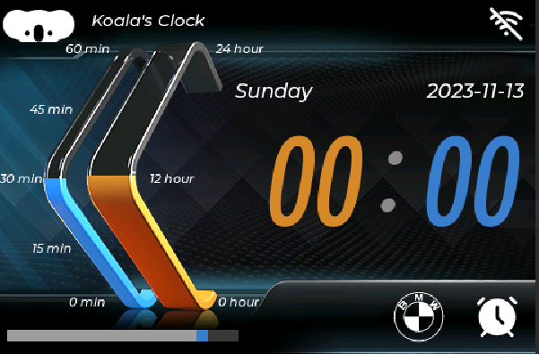

# A Clock based on ESP32S3

Here is a clock UI, based on WT-SC01-PLUS, which has ESP32S3 chip.

  

## What can it do

* A Clock (Time from internet)
* A Timer (For kid's homework)
* A car brand slider (read from SD card, just for fun)
* adjust background light (At 22:10 gets lower brightness, and turns more bright at 7:00 everyday)
* A weather (NOT finished, 2 weeks later, pherhaps...)

## What it involves

* Arduino Framework
* VS code with PlatformIO
* A ESP32S3 chip 2M psram
* A TF card
* Squareline
* wifi connected internet

## Hardware

WT-SC01-PLUS (aka.ZX3D50CE02S-USRC-4832 in China)

## UI

I have modified the Squareline example *Futuristic_Ebike*, the ordinary like this:

  

I re-use the background and sliders pictures, fonts and etc., because it's hard to me.

The new one like this:

   

BTW, Squareline is amazing, that can make UI so easily.

## How to use

* This program is composed by VSCode with PlatformIO. Check the `platformio.ini` to fit your env.
* **Squareline** source is in the `SquareLineProjects` folder, if you want to modify UI, import the folder to Squareline.
* **SD card** root files are in the `SDCardFiles` folder. Copy all files to SD root.
* Rest of these are C/C++ sources.
* Put your wifi name and password in `main.h`

    ~~~ C
    // insert your wifi name
    const char *ssid = "";
    // insert your wifi password
    const char *password = "";
    ~~~

Enjoy it.
